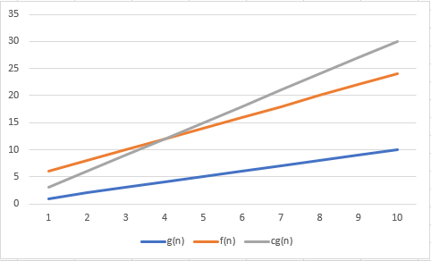

# 1 Problema
### Quais são as duas características mais comuns para analisar algoritmos?
Tempo e consumo de memória, respectivamente Complexidade de Tempo e de espaço
# 2 Problema
### Por que a medida de tempo em segundos não representa qualificadamente o tempo de execução de um algoritmo?
Pois o tempo de execução de um algoritmo ou método da estrutura de dados é afetado pelo ambiente de hardware (compilador, processador, Sistema operacional, linguagem de programaçāo, etc) e tamanho da entrada.  
Medição de tempo em segundos não é uma medida estável e de qualidade.  
A medida deve ser independente de tecnologia (software ou hardware)
# 3 Problema
### A medida de tempo de um algoritmo é realizada através de qual informação?
A medição de tempo é feita através da quantidade de passos que o algoritmo precisa para finalizar sua execução.
### O que pode afetá-la?
O tamanho da entrada.
# 4 Problema
### Na análise de algoritmos, qual é o valor da base da função logarítmica e exponencial?
Da logarítmica e da exponencial é 2.
### Por que é escolhido este valor?
É escolhido 2 pois representa valor binário.
# 5 Problema
### O que é complexidade de tempo?
De *M*. É a função *f*: N -> N, onde *f(n)* é o número máximo de passos que *M* usa sobre entradas de comprimento *n*. É um costume generalizado usar *n* para representar o comprimento de entrada.
# 6 Problema
### Dado dois algoritmos A e B com as complexidades de tempo respectivamente *f1* e *f2*, qual é o melhor algoritmo? O que indica qual é o melhor algoritmo?
O algoritmo com a menor complexidade de tempo é o melhor. O algoritmo que tiver a função com o menor valor representa uma solução, ou seja, o algoritmo precisa de menos tempo ou passsos para resolver o problema.
# 7 Problema
### Em uma função de complexidade, o que representa o termo n?
Representa o comprimento de entrada.
# 8 Problema
### Quais são as operações primitivas de um algoritmo?
- Atribuição de valores a variáveis
- Chamadas de métodos
- Operações aritméticas (por exemplo, adição de dois números)
- Comparação de dois números
- Acesso a um arranjo
- Seguimento de uma referência para um objeto
- Retorno de um método
# 9 Problema
### Qual é o valor de uma operação primitiva de um algoritmo?
O valor que se atribui é 1.
# 10 Problema
### Desenvolva o pseudocódigo do algoritmo SOMA, que realiza a soma de dois números inteiros recebidos por parâmetro e tem como saída a resultado da operação. Identifique a sua função de complexidade de tempo.
``` js
soma (a, b) {
    return a + b;
}

soma(1,2);
```

| soma(a, b): | Custo | Vezes |
|-------------|-------|-------|
| s <- a + b  | c1    | 1     |
| retorna s   | c2    | 1     |

*f(n)* = c1 * 1 + c2 * 1  
*f(n)* = 1 * 1 + 1 * 1  
*f(n)* = 1 + 1  
*f(n)* = 2
# 11 Problema
### Desenvolva o pseudocódigo do algoritmo SOMA_VETOR, que realiza a soma de todos os elementos de um vetor. O algoritmo recebe o vetor V e tem como saída o resultado. Identifique a sua função de complexidade de tempo.
``` js
soma(vetor) {
    let soma = 0;
    for (let i = 0; i <= vetor.length; i++) {
        soma += vetor[i];
    }
    return soma;
}

soma([1,2,3,4,5,6]);
```

| soma(vetor):                    | Custo | Vezes |
|---------------------------------|-------|-------|
| s <- 0                          | c1    | 1     |
| para i <- 1 até vetor.tamanho   | c2    | n     |
| s <- s + vetor[i]               | c3    | n     |
| i <- i + 1                      | c4    | n     |
| retorna s                       | c5    | 1     |

*f(n)* = c1 * 1 + c2 * n + c3 * n + c4 * n + c5 + 1  
*f(n)* = 1 * 1 + 1 * n + 1 * n + 1 * n + 1 * 1  
*f(n)* = 1 + n + n + n + 1  
*f(n)* = 3n + 2
# 12 Problema
### Desenvolva o pseudocódigo do algoritmo CONTAGEM_IMPARES, que realiza a contagem de números impares de um vetor. O algoritmo recebe o vetor V e tem como saída o resultado. Identifique a sua função de complexidade de tempo.
``` js
soma(vetor) {
    let soma = 0;
    for (let i = 0; i <= vetor.length; i++) {
        if (vetor[i]%2 != 0) {
            soma += vetor[i];
        }
    }
    return soma;
}

soma([1,2,3,4,5,6]);
```

| soma(vetor):                  | Custo | Vezes |
|-------------------------------|-------|-------|
| s <- 0                        | c1    | 1     |
| para i <- 1 até vetor.tamanho | c2    | n     |
| se vetor[i] %2!= 0 entao      | c3    | n     |
| s <- s + vetor[i]             | c4    | n     |
| i <- i + 1                    | c5    | n     |
| retorna s                     | c6    | 1     |

*f(n)* = c1 * 1 + c2 * n + c3 * n + c4 * n + c5 * n + c6 * 1  
*f(n)* = 1 * 1 + 1 * n + 1 * n + 1 * n + 1 * n + 1 * 1  
*f(n)* = 1 + n + n + n + n + 1  
*f(n)* = 4n + 2
# 13 Problema
### Desenvolva o pseudocódigo do algoritmo SOMA_MATRIZ, que realiza a soma de todos os elementos de uma matriz. O algoritmo recebe a matriz M e tem como saída o resultado. Identifique a sua função de complexidade de tempo.
``` js
soma(matriz) {
    let soma = 0;
    for (let i = 0; i <= matriz.length; i++) {
        for (let j = 0; j <= matriz[i]; j++) {
            soma += matriz[i][j];
        }
    }
    return soma;
}

soma([[1,2],[2,3],[3,4],[4,5],[5,6],[6,7]]);
```

| soma(matriz):                     | Custo | Vezes |
|-----------------------------------|-------|-------|
| s <- 0                            | c1    | 1     |
| para i <- 1 até matriz.tamanho    | c2    | n     |
| para j <- 1 até matriz[i].tamanho | c3    | n * n |
| s <- s + matriz[i][j]             | c4    | n * n |
| j <- j + 1                        | c5    | n * n |
| i <- i + 1                        | c6    | n     |
| retorna s                         | c7    | 1     |

*f(n)* = c1 * 1 + c2 * n + c3 * nn + c4 * nn + c5 * nn + c6 * n + c7 * 1  
*f(n)* = 1 * 1 + 1 * n + 1 * n² + 1 * n² + 1 * n² + 1 * n + 1 * 1  
*f(n)* = 1 + n + n² + n² + n² + n + 1  
*f(n)* = 3n² + 2n + 2
# 14 Problema
### Desenvolva o pseudocódigo do algoritmo BUSCA_MATRIZ, que identifica posição x e y de um elemento em uma matriz. O algoritmo recebe a matriz M e o valor V e tem como saída a posição x e y . Identifique a sua função de complexidade de tempo.
``` js
buscaMatriz(matriz, valor) {
    for (let i = 0; i <= matriz.length; i++) {
        for (let j = 0; j <= matriz[i]; j++) {
            if (matriz[i][j] == valor) {
                return [i, j];
            }
        }
    }
    return null;
}

buscaMatriz([[1,2],[2,3],[3,4],[4,5],[5,6],[6,7]], 2);
```

| buscaMatriz(matriz, valor):       | Custo | Vezes |
|-----------------------------------|-------|-------|
| para i <- 1 até matriz.tamanho    | c1    | n     |
| para j <- 1 até matriz[i].tamanho | c2    | n * n |
| se matriz[i][j] == valor          | c3    | n * n |
| retorna [i,j]                     | c4    | 1     |
| j <- j + 1                        | c5    | n * n |
| i <- i + 1                        | c6    | n     |
| retorna s                         | c7    | 1     |

*f(n)* = c1 * n + c2 * nn + c3 * nn + c4 * 1 + c5 * nn + c6 * n + c7 *1  
*f(n)* = 1 * n + 1 * n² + 1 * n² + 1 * 1 + 1 * n² + 1 * n + 1 * 1  
*f(n)* = n + n² + n² + 1 + n² + n + 1  
*f(n)* = 3n² + 2n + 2
# 15 Problema
### O que é análise assintótica?
O tempo exato de um algoritmo é frequentemente uma expressão complexa. Tanto para identificar como para calcular.
### Qual é o seu objetivo?
Compreender o tempo de execução para **entradas grandes**, ou seja, é um método de descrever o comportamento de **limites**.
# 16 Problema
### Qual é o processo da análise assintótica? Crie um exemplo.
1. *f(n)* = 6n³ + 2n² + 20n + 45
2. Identificar o componente de maior ordem: 6n³
3. Ignorar os coeficientes = n³  
Dizemos que *f* é assintoticamente no máximo n³.
# 17 Problema
### O que é a notação assintótica?
A notação assintótica ou notação O-grande (Big-Oh) é usada para descrever o relacionamento é *f(n) = O(n3)*. Formalmente definimos como: Onde ***R+*** é o conjunto dos reais não negativos
# 18 Problema
### O que é a notação O-Grande ou Big-Oh?
Diz que uma função é ***menor que ou igual*** a outra função g(n). x Ou seja, ***f*** é limitada superiormente por ***g*** (até no máximo um fator constante) assintoticamente.
# 19 Problema
### Qual é a definição formal da notação O-Grande?
Sejam ***f*** e ***g*** funções ***f,g*** **: N → R+.** Digamos que ***f(n) = O(g(n))*** se existem inteiros positivos ***c*** e **n0** tais que para todo
inteiro ***n ≥ n0***
### ***f(n) ≤ cg(n).***
Quando ***f(n) = O(g(n))*** dizemos que ***g(n)*** é o limite superior para f(n) ou, mais precisamente, que ***g(n)*** é um limitante
assintótico para ***f(n)***, para enfatizar que estamos suprimento fatores constantes.
# 20 Problema
### Crie um gráfico explicando a notação O-grande. Utilize *f(n)* = 2n + 4. Qual é um valor possível para n0?
**n0 = 3**

# 21 Problema
### O que é a notação o-pequeno ou Little-Oh?
A notação o-–pequeno diz que uma função é ***menor que*** a outra função g(n). Ou seja, **f** é dominada por **g** assintoticamente.
# 22 Problema
### Qual é a definição formal da notação o-pequeno?
Formalmente definimos como: Onde ***R+*** é o conjunto dos reais não negativos.
# 23 Problema
### Crie um gráfico explicando a notação o-pequeno.

# 24 Problema
### Passe a notação O-grande e o-pequeno as funções abaixo:
### A *F(n)* = n + 1
O(n)  
o(n²)
### B *F(n)* = 8
O(1)  
o(n)
### C *F(n)* = 2n² − 1
O(n²)  
o(2 ^ n)
### D *F(n)* = nlogn
O(logn)  
o(n²)
### E *F(n)* = 3n! + 2n
O(n!)  
o(n!²)
### F *F(n)* = 3n³ + 2n² + 4n + 6
O(n³)  
o(n!)
### G *F(n)* = 5^n + 11
O(5 ^ n)  
o(n * n!)
### H *F(n)* = 3logn
O(logn)  
o(n²)
# 25 Problema
### Identifique o O-Grande dos algoritmos desenvolvidos nos Problemas 10 até 14.
### 10 - *f(n)* = 2
O(1)
o(n)
### 11 - *f(n)* = 3n + 2
O(n)
o(nlogn)
### 12 - *f(n)* = 4n + 2
O(n)
o(n²)
### 13 - *f(n)* = 3n² + 2n + 2
O(n²)
o(n!)
### 14 - *f(n)* = 3n² + 2n + 2
O(n²)
o(2 ^ n)